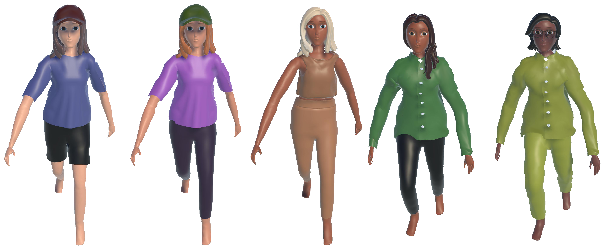

# Avatar: Legend of VR
This project was created during the course "Human-robot-interaction" and includes all written code and our research dokumentation.

## Abstract 
As large parts of our lives increasingly take place online, with platforms like Zoom, Google Meet, and Facetime being used everyday by millions of people, the world of virtual avatars as well as their design gets more and more important. This study investigates whether people prefer to interact with virtual avatars that match their visual preferences. We conducted a VR experiment with 13 participants where they had to make several decisions between two avatars that matched their preferences to different degrees. Afterwards, participants filled out a questionnaire to assess the reasoning behind their decisions. 
Our analysis shows that participants were more likely to chose and keep those avatars that matched their preferences to a higher degree and that visual appearance in the form of color and style was the main influence on their selections.
We conclude that people indeed seem to prefer interacting with avatars that match their own visual preferences, however, more research needs to be done on this topic to determine which visual factors have the largest influence on how people perceive virtual avatars and also how much importance movement and posture have in that regard.
